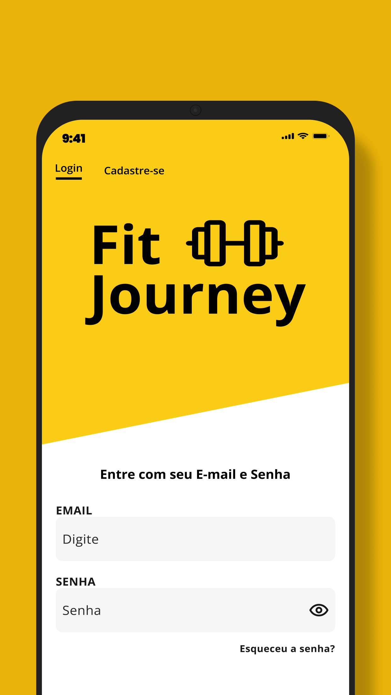
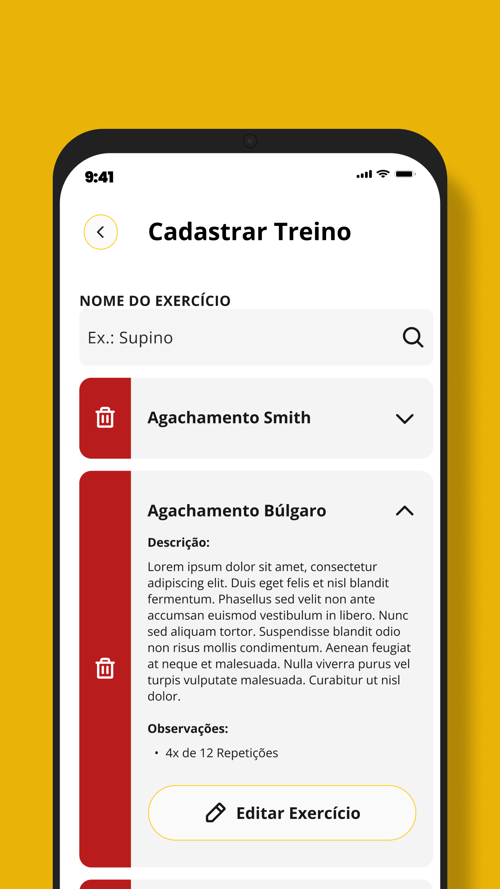
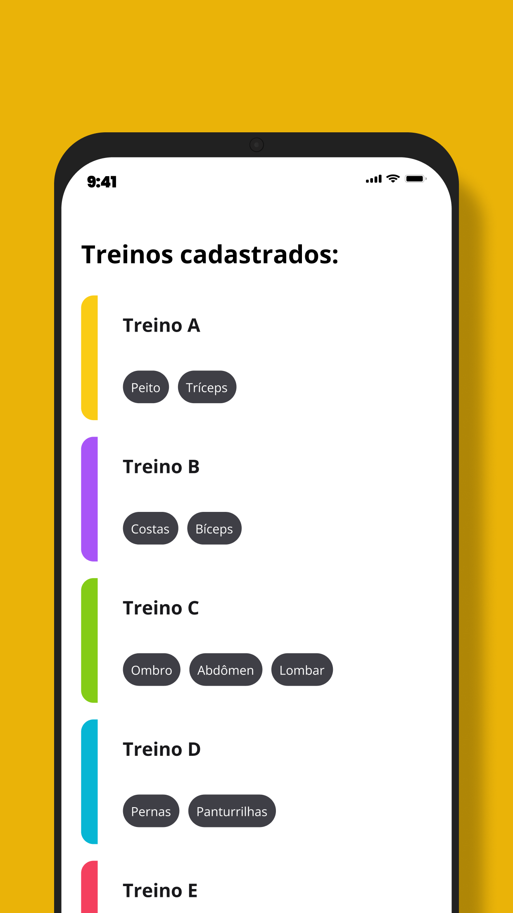
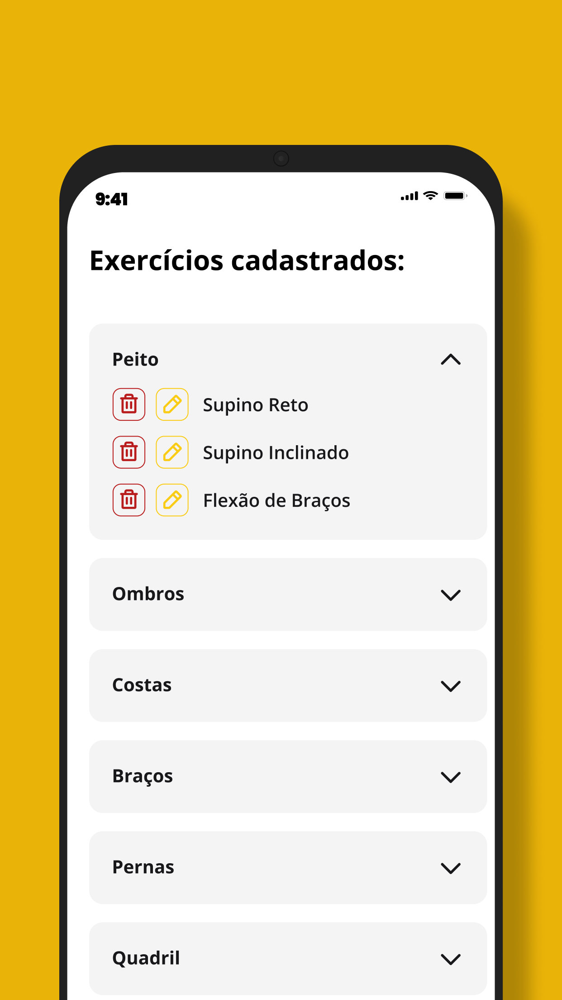
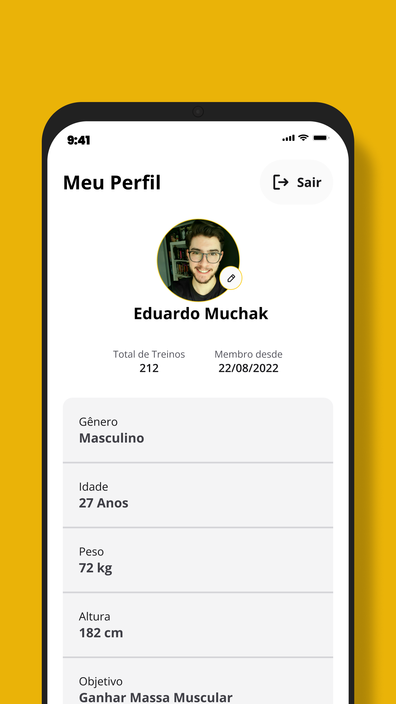

# Fit Journey 🏋️‍♂️📱

Bem-vindo ao Fit Journey, sua nova parceira de treinos para levar sua jornada de fitness para o próximo nível! Este aplicativo foi desenvolvido com dedicação usando React Native com Expo e TypeScript, proporcionando uma experiência suave e consistente.

  

## Recursos Principais

- **Estilo Elegante**: Utilizamos TailwindCSS para estilizar o aplicativo, criando uma interface intuitiva e agradável.

- **Integração com Google**: O Fit Journey está integrado com os poderosos serviços de nuvem da Google, incluindo Firebase, Firestore e login social com Google Auth.

- **Cadastro Simplificado**: Crie sua conta com facilidade usando e-mail/senha ou faça login com sua conta do Google.

- **Recuperação de Senha**: Recupere sua senha em apenas alguns cliques, para que você nunca perca o acesso à sua conta.

- **Gerencie seus Exercícios**: Crie, edite e personalize seus exercícios para atender às suas metas de forma personalizada.

- **Treinos Personalizados**: Monte treinos personalizados para obter resultados eficazes e atingir seus objetivos de forma eficiente.

## Como Testar

O aplicativo está agora disponível em sua primeira versão, que é um beta para teste. Você pode baixá-lo no seu smartphone Android e testá-lo por si mesmo. Estamos ansiosos para receber seus comentários e sugestões para melhorias!

- **Link para Play Store**: https://play.google.com/store/apps/details?id=com.emgp.fitjourney

## Próximos Passos

Os próximos passos do projeto incluem:

- **Portal Web**: Desenvolvimento de um portal web para acesso da academia para gerenciamento dos alunos e de seus treinos.

- **Métricas de Treino**: Adicionar funcionalidades de métricas de treino e acompanhamento do histórico do aluno através do aplicativo.

- **Versão para Smartwatches**: Estamos trabalhando em uma versão para smartwatches para tornar o Fit Journey ainda mais acessível e conveniente.

Agradecemos por fazer parte da jornada do Fit Journey e esperamos ajudá-lo a atingir seus objetivos de fitness!

## Screenshots

  
  
  
  

  

  

  

&#xa0;

